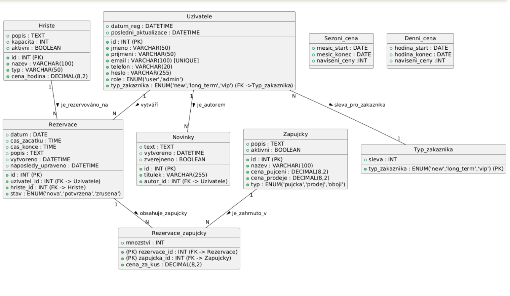
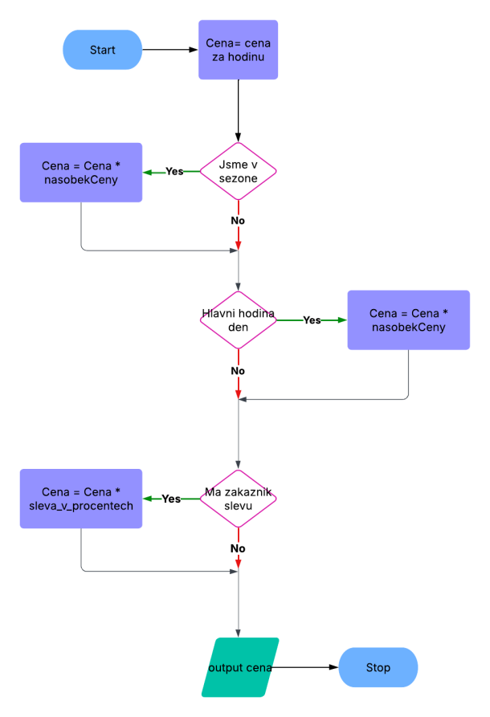

# VPSI - Vybrané partie ze softwarového inženýrství 

## Informace o předmětu

- __Organizace:__ VŠB-TUO FEI KI
- __Předmět:__ Vybrané partie ze softwarového inženýrství
- __Zkratka předmětu:__ VPSI
- __Ročník:__ 3.
- __Garant předmětu:__ Ing. Svatopluk Štolfa, Ph.D.
- __Vedoucí cvičení:__ Ing. Jakub Štolfa, Ph.D.
- __Počet kreditů:__ 3

## Informace o projektu

- __Zadání:__ Vytvořte projekt za použití moderních technik softwarového inženýrství. Využijte praktických znalostí z předmětu SWI (Úvod do softwarového inženýrství) a VPSI (Vybrané partie ze softwarového inženýrství) pro vytvoření projektu v rámci vytvořeného týmu o velikosti 6 lidí. Pokuste se pracovat v týmu a vytvořte projekt, které vám určí zákazník. Zadání zákazníka [zde](./VPSI-Zadani.pdf).
- __Název vývojářského týmu:__ Poslední řada
- __Složení týmu a role:__
    -   _Anna Gocieková_ - Product Owner
    -   _Jiří Fousek_ - Scrum Master
    -   _Lukáš Horák_ - Fullstack Developer
    -   _Jakub Krčmář_ - Fullstack Developer
    -   _Jakub Śmieja_ - Fullstack Developer
    -   _Jiří Krokviak_ - Fullstack Developer
-   __Zákazník:__ Bumbrlíci s.r.o.
-   __Název projektu:__ Bumbrlíci Sportoviště
-   __Logo projektu:__
  

-   __Použité technologie:__
    -   __Front-end:__ Bootstrap
    -   __Back-end:__ Django (Python) w/SQLite
    -   __Zálohovací systém:__ Git (GitHub)
-   __Použitá vývojová metoda:__ SCRUM
    - Sprint/týden
    - Plánováno 6 sprintů

> Django is a high-level Python web framework that encourages rapid development and clean, pragmatic design. Built by experienced developers, it takes care of much of the hassle of web development, so you can focus on writing your app without needing to reinvent the wheel. It’s free and open source. [Django](https://www.djangoproject.com/)

> Powerful, extensible, and feature-packed frontend toolkit. Build and customize with Sass, utilize prebuilt grid system and components, and bring projects to life with powerful JavaScript plugins. [Bootstrap](https://getbootstrap.com/)

# Django

Webová aplikace je vytvořená v programovacím jazyce Python a využívá __Django__ Frameworku. Aplikace je v prototypové fázi a jejím cílem je splnit požadavky dané uživatelem. V průběhu projektu je zákazník dotazován a popřípadě je tým usměrňován ke správnému výsledku aplikace a splnění všech požadavků, které byly dány.

> __superuser:__ root, __password:__ 123  
> __Uživatel:__ test@test.com, __password:__ 123

# Návrh databáze

# Float chart diagram

# Wireframe

Prototypový vzhled webové aplikace lze nalézt v doplňkovém souboru uložený v repozitáři [zde](./VPSI-wireframe.pdf).

# Diagram komponent

<embed src="./VPSI_component_diagram.pdf" width="100%">

# Use-case diagram

<embed src="./VPSI_case_diagram.pdf" width="100%">

# How to run
`python manage.py runserver`